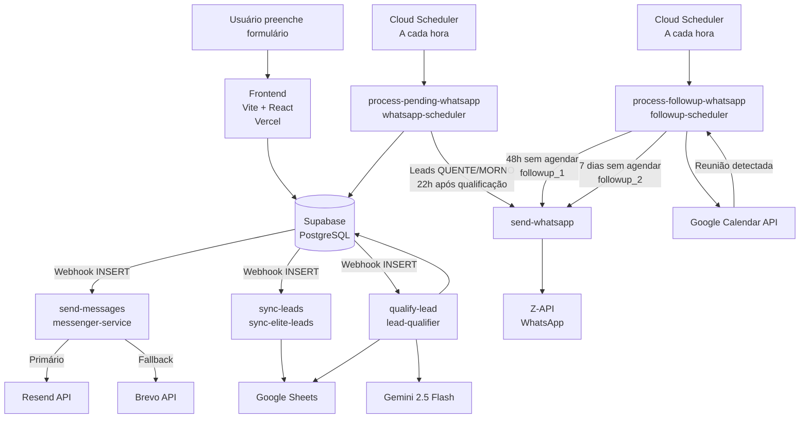

# Arquitetura — Elite Portal USA

## Fluxo de dados



## Fluxo completo de um lead

```
Form Submit → Supabase INSERT
    ↓ (webhook simultâneo)
  messenger-service → emails de confirmação (Resend/Brevo)
  sync-elite-leads  → Google Sheets (colunas A–AP)
  lead-qualifier    → Gemini AI → QUENTE / MORNO / FRIO
    ↓ FRIO → encerrado aqui
    ↓ QUENTE/MORNO
  [22h após qualificação]
  whatsapp-scheduler → send-whatsapp (messageType: initial)
    → WhatsApp para atleta + responsável (com link Google Calendar)
    ↓ se não agendar reunião
  [48h após whatsapp inicial]
  followup-scheduler → Google Calendar check → send-whatsapp (followup_1)
    → WhatsApp de urgência para atleta + responsável
    ↓ se não agendar reunião
  [7 dias após whatsapp inicial]
  followup-scheduler → Google Calendar check → send-whatsapp (followup_2)
    → WhatsApp de encerramento de ciclo para atleta + responsável
    ↓ a qualquer momento
  Google Calendar detecta reunião → meeting_scheduled = true → para follow-ups
```

## Cloud Functions

| Pasta local | Nome GCP | Trigger | Responsabilidade |
|---|---|---|---|
| `functions/send-messages/` | `messenger-service` | Webhook Supabase INSERT | E-mails de confirmação ao atleta, responsável e equipe interna |
| `functions/sync-leads/` | `sync-elite-leads` | Webhook Supabase INSERT | Sincroniza dados do lead com Google Sheets (colunas A–AP) |
| `functions/qualify-lead/` | `lead-qualifier` | Webhook Supabase INSERT | Classifica lead via Gemini 2.5 Flash (QUENTE/MORNO/FRIO) |
| `functions/send-whatsapp/` | `send-whatsapp` | HTTP POST | Envia WhatsApp via Z-API (initial / followup_1 / followup_2) |
| `functions/process-pending-whatsapp/` | `whatsapp-scheduler` | Cloud Scheduler (1x/hora) | Processa fila de WhatsApp inicial (22h após qualificação) |
| `functions/process-followup-whatsapp/` | `followup-scheduler` | Cloud Scheduler (1x/hora) | Processa follow-ups 48h e 7 dias sem agendamento de reunião |

## Cloud Scheduler Jobs

| Job | Função alvo | Schedule | Timeout | Responsabilidade |
|---|---|---|---|---|
| `process-whatsapp-job` | `whatsapp-scheduler` | `0 * * * *` (toda hora) | 960s | WhatsApp inicial 22h após qualificação |
| `process-followup-job` | `followup-scheduler` | `0 * * * *` (toda hora) | 960s | Follow-ups 48h e 7 dias sem agendamento |

## Classificação de leads (Gemini 2.5 Flash)

| Classificação | Critérios |
|---|---|
| 🔥 QUENTE | Profissão sustenta claramente a faixa de investimento + dados coerentes |
| 🌡️ MORNO | Renda questionável MAS endereço/escola confirmam alto padrão de vida |
| 🧊 FRIO | Capacidade financeira incompatível OU dados inconsistentes/aleatórios |

**Regra especial (renda variável):** Analista, financeiro, gestor, marketing, comercial, consultor, corretor, trader, assessor → em dúvida entre FRIO e MORNO, classificar como **MORNO**.

## Banco de dados — Colunas críticas de `form_submissions`

| Coluna | Tipo | Descrição |
|---|---|---|
| `qualified` | boolean | Lead qualificado? |
| `qualification_classification` | text | `QUENTE`, `MORNO` ou `FRIO` |
| `qualification_reason` | text | Justificativa 2–4 frases do Gemini |
| `qualified_at` | timestamptz | Quando foi qualificado |
| `whatsapp_sent_at` | timestamptz | Quando o WhatsApp inicial foi enviado |
| `followup_1_sent_at` | timestamptz | Quando o follow-up de 48h foi enviado |
| `followup_2_sent_at` | timestamptz | Quando o follow-up de 7 dias foi enviado |
| `meeting_scheduled` | boolean | Reunião detectada via Google Calendar API |
| `meeting_scheduled_at` | timestamptz | Quando a reunião foi detectada |

**Chave única:** `UNIQUE(email, athlete_name)` — mesmo atleta não duplica.

## Proteções anti-duplicata no fluxo de follow-up

| Camada | Mecanismo | O que previne |
|---|---|---|
| 1 | `whatsapp_sent_at IS NULL` no SELECT | WhatsApp inicial enviado 2x |
| 2 | `meeting_scheduled IS NOT TRUE` | Follow-up após reunião agendada |
| 3 | CAS atômico: `PATCH` com `&followup_X_sent_at=is.null` | Race condition entre instâncias concorrentes do scheduler |
| 4 | `followup_1_sent_at < executionStartTime` | followup_1 e followup_2 enviados na mesma execução para o mesmo lead |

## Custos estimados mensais

| Serviço | Custo estimado |
|---|---|
| Google Cloud Functions (6 funções) | ~$5-8/mês |
| Cloud Scheduler (2 jobs) | ~$0.20/mês |
| Supabase (Pro) | ~$25/mês |
| Resend | ~$0-3/mês |
| Z-API | Plano fixo |
| Vercel | Gratuito |
| **Total** | **~$30-36/mês** |

## Segurança

- Variáveis de ambiente configuradas diretamente no GCP (nunca no código)
- Supabase RLS habilitado: apenas `service_role` tem acesso completo; `anon` só pode inserir
- Autenticação entre serviços via header `x-webhook-secret`
- Deploy via Workload Identity Federation (sem Service Account Keys no repositório)
- Logs estruturados em JSON — nenhum dado sensível é logado
